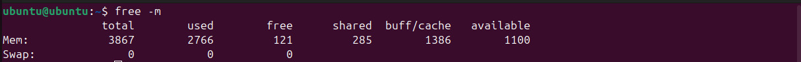

cat << 'EOF' > lab0.md
# LAB 1 : INSTALL VIRTUAL PLAYER AND LINUX

## WHAT IS LINUX ?

Linux is an open-source operating system kernel that serves as the foundation for various operating systems, commonly referred to as Linux distributions (or distros).  
Developed by Linus Torvalds in 1991, Linux is known for its stability, security, and versatility, making it popular for servers, desktops, embedded systems, and more.

---

## STEP 1 : DOWNLOAD VIRTUALBOX FILE


1. Go to the VirtualBox Website
2. Select your operating system

**VirtualBox Platform Packages**

- VirtualBox 7.1.0 platform packages  
  - Windows hosts  
  - macOS/Intel hosts  
  - macOS/Apple Silicon hosts  
  - Linux distributions  
  - Solaris hosts  
  - Solaris 11 IPS hosts  

Platform packages are released under the terms of the GPL version 3.

### VirtualBox Extension Pack

- VirtualBox 7.1.0 Extension Pack

By downloading, you agree to the terms and conditions of the respective license.

---

## STEP 2: INSTALLING VIRTUAL BOX


**1. The beginning**  
Oracle VM VirtualBox 7.0.8 Setup

**Custom Setup**  
Select the way you want features to be installed.  
Click on the icons in the tree below to change the way features will be installed.

- VirtualBox Application  
- VirtualBox USB Support  
- VirtualBox Networking  
- VirtualBox Bridged Network  
- VirtualBox Host-Only Network  
- VirtualBox Python Support

This feature requires 210MB on your hard drive. It has 3 of 3 subfeatures selected.  
The subfeatures require 1000KB on your hard drive.

Location: `C:\Program Files\Oracle\VirtualBox\`

**2. Select installation location**

**3. Ready to install**  
Click Install to begin the installation. If you want to review or change any installation settings, click Back.  
Click Cancel to exit the wizard.

**4. Installation complete**  
Click the Finish button to exit the Setup Wizard.

**5. Opening VirtualBox**  
Welcome to VirtualBox!  
The left part of the application window contains global tools and lists all virtual machines and virtual machine groups on your computer.  
You can import, add, and create new VMs using corresponding toolbar buttons.

---

## STEP 3: INSTALLING LINUX USING VIRTUALBOX


**1. Naming virtual machine**

- After installing VirtualBox, click **New**.
- Write the Name you want for your system, e.g., *Linux Mint*
- Select Type: **Linux**.
- Select Version: **Ubuntu**
- Select your ISO image if you have one, or install manually.

**2. Select the amount of RAM**

- You can modify virtual machine's hardware by changing the amount of RAM and virtual CPU count.  
- Base Memory: you may set between 2048 MB to 8192 MB  
- Processors: 1 to 4 CPUs

**3. Hard Disk setting**

- Choose 'Create a virtual hard drive Now', in order to make a virtual disk space.  
- Select the amount of hard drive size (e.g., 8 GB or more).

**4. Launching your System**

- Choose the downloaded Linux ISO file.
- Click Start to launch your system.
- If you see "No bootable medium found", select your .iso file and retry.

**5. Final installation**

- Click Install Linux Mint.
- Enter your account details:
  - Your name: SAM
  - Computer's name: sam-VirtualBox
  - Pick a username: sam
  - Choose a password
  - Set login preferences

CONGRATULATIONS!  
YOU HAVE SUCCESSFULLY INSTALLED THE UBUNTU LINUX.

---

### RUNNING BASIC COMMANDS IN UBUNTU TERMINAL 
```bash 
lsb_release -a
```

```bash
uname -a
```


```bash
df -h
```


```bash
free -m 
```



---
### Q1: What are two advantages of installing Ubuntu in VirtualBox?

- 1. Safe testing environment
- 2. Easy setup and removal

### Q2: What are two advantages of dual booting instead of using a VM?

- 1. Full hardware performance
- 2. Better graphics & GPU support
