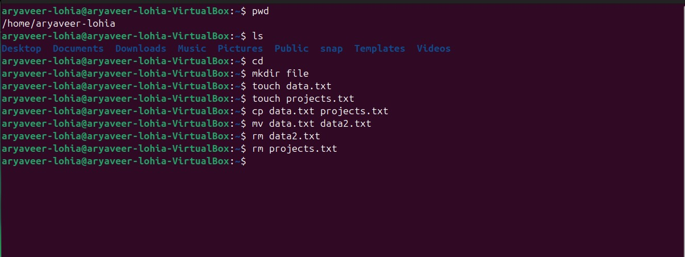

cat << 'EOF' > lab1.md
# 📌 We will be walking through basic linux terminal commands

---

## ✅ 1. Navigation Commands

### pwd – Print Working Directory

*Shows the current location in the filesystem.*

**Output example:**  
`/home/HPVICTUS/Deskstop/vg/linux_lab`

---

### ls – List Directory Contents

- The `ls` command is used to list files and directories in the current working directory.
- Flag `-a` lists down all files and folders including hidden ones.

  - `ls -l` → Detailed list (permissions, size, date)  
  - `ls -a` → Shows hidden files (those starting with .)  
  - `ls -la` → Combined

---

### cd – Change Directory

*Moves into a directory.*

**Examples:**

---

## ✅ 2. File and Directory Management

### mkdir – Make Directory

*Creates a new folder.*

### touch – Create File

*Creates an empty file.*

### cp – Copy Files or Directories

### mv – Move or Rename Files

### rm – Remove Files

⚠️ *Be careful! There is no undo.*

---

## ✅ 3. File Viewing & Editing

### cat – View File Contents

*Displays content in terminal.*

### nano – Edit Files in Terminal

*A basic terminal-based text editor.*

- Use arrows to move.
- CTRL + O to save.
- CTRL + X to exit.

### clear – Clears the Terminal

*Shortcut: CTRL + L*

*Useful for debugging or scripting.*

---

## ✅ 4. System Commands

### echo – Print Text

### whoami – Show Current User

### man – Manual for Any Command

*Use q to quit the manual.*

---

## ✅ 5. Searching and Finding

### find – Locate Files

*Finds all .txt files in current folder and subfolders.*

### grep – Search Inside Files

*Searches for the word 'hello' inside file.txt.*

---

## ✅ 6. Helpful Shortcuts

| Shortcut   | Action                         |
| ---------- | ----------------------------- |
| Tab        | Auto-complete files/folders    |
| ↑ / ↓      | Browse command history         |
| CTRL + C   | Stop a running command         |
| CTRL + L   | Clear screen                   |

---

## ✅ 7. Bonus: Chaining Commands

- Run multiple commands:
  - *Run only if previous command succeeds*: `&&`
  - *Run regardless of success*: `;`

---

## 🐚 Shell Tutorial – File Permissions with chmod and chown

### 🔹 1. Understanding File Permissions in Linux

Each file/directory in Linux has:
- Owner → The user who created the file.
- Group → A group of users who may share access.
- Others → Everyone else.

*r* → Read (4 in numeric)  
*w* → Write (2 in numeric)  
*x* → Execute (1 in numeric)

**Example from ls -l:**

Breakdown:
- `-` → Regular file (d = directory, l = symlink, etc.)
- `rwx` → Owner has read, write, execute
- `r-x` → Group has read, execute
- `r--` → Others have read only

---

### 🔹 2. chmod – Change File Permissions

**Syntax**

#### (A) Numeric (Octal) Method

Each permission is represented as a number:
- Read = 4
- Write = 2
- Execute = 1

Add them up:
- 7 = rwx
- 6 = rw-
- 5 = r-x
- 4 = r--
- 0 = ---

Meaning:
- Owner: 7 → rwx
- Group: 7 → rwx
- Others: 7 → rwx

**Example:**

#### (B) Symbolic Method

Use `u` (user/owner), `g` (group), `o` (others), `a` (all). Operators:
- `+` → Add permission
- `-` → Remove permission
- `=` → Assign exact permission

Modes can be set in numeric (octal) or symbolic form.

#### (C) Recursive Changes

`-R` → applies changes recursively to all files/subdirectories.

---

### 🔹 3. chown – Change File Ownership

**Syntax**

**Examples:**

#### Practice Experiment on chown

1. Create a new user  
   `sudo useradd -m newuser`
2. Create a new group  
   `sudo groupadd newgroup`
3. Add the user to the group  
   `sudo usermod -aG newgroup newuser`
4. Create a file (as current user, e.g. root or your login user)  
   `touch testfile.txt`  
   `ls -l testfile.txt`
5. Assign ownership of the file to newuser and newgroup  
   `sudo chown newuser:newgroup testfile.txt`
6. Verify ownership  
   `ls -l testfile.txt`

*Output:*

---

### 🔹 4. Putting It All Together

**Example Scenario**

---

### 🔹 5. Quick Reference Table

| Numeric | Permission | Meaning        |
| ------- | ---------- | ------------- |
| 0       | ---        | No access     |
| 1       | --x        | Execute only  |
| 2       | -w-        | Write only    |
| 3       | -wx        | Write + Exec  |
| 4       | r--        | Read only     |
| 5       | r-x        | Read + Exec   |
| 6       | rw-        | Read + Write  |
| 7       | rwx        | Full access   |

---

### 📌 Q1: what is the difference between chmod and chown?

- **chown** – change ownership (change the owner and group of a file or directory)
- **chmod** – change permissions (changes the permissions for the owner, group, and others)

---

### 📌 Q2: how do you check current directory and user?

- ans = by using the `pwd` command.

## answer of all the commands in assignment:
