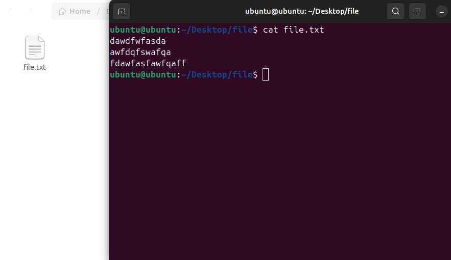

cat << 'EOF' > lab1.md
# 📌 We will be walking through basic linux terminal commands

---

## ✅ 1. Navigation Commands

### pwd – Print Working Directory


*Shows the current location in the filesystem.*

**Output example:**  
```bash
/home/ubuntu
```

---

### ls – List Directory Contents


- The `ls` command is used to list files and directories in the current working directory.
- Flag `-a` lists down all files and folders including hidden ones.

  - `ls -l` → Detailed list (permissions, size, date)

```bash

  total 0
drwxr-xr-x 2 ubuntu ubuntu  60 Sep 15  2025 Desktop
drwxr-xr-x 2 ubuntu ubuntu  40 Sep 15  2025 Documents
drwxr-xr-x 2 ubuntu ubuntu  40 Sep 15  2025 Downloads
drwxr-xr-x 2 ubuntu ubuntu  40 Sep 15  2025 Music
drwxr-xr-x 3 ubuntu ubuntu  60 Sep 15 12:58 Pictures
drwxr-xr-x 2 ubuntu ubuntu  40 Sep 15  2025 Public
drwx------ 5 ubuntu ubuntu 100 Sep 15 12:58 snap
drwxr-xr-x 2 ubuntu ubuntu  40 Sep 15  2025 Templates
drwxr-xr-x 2 ubuntu ubuntu  40 Sep 15  2025 Videos

```  
  - `ls -a` → Shows hidden files (those starting with .)  
 
 
```bash 

  .   .bash_logout  .cache   Desktop    Downloads  .gvfs   Music     .profile  snap  .sudo_as_admin_successful  Videos
..  .bashrc       .config  Documents  .gnupg     .local  Pictures  Public    .ssh  Templates

```


  - `ls -la` → Combined
```bash 
total 12
drwxr-x--- 17 ubuntu ubuntu  420 Sep 15 12:52 .
drwxr-xr-x  1 root   root     80 Sep 15  2025 ..
-rw-r--r--  1 ubuntu ubuntu  220 Sep 15  2025 .bash_logout
-rw-r--r--  1 ubuntu ubuntu 3771 Sep 15  2025 .bashrc
drwx------  9 ubuntu ubuntu  200 Sep 15 12:58 .cache
drwxr-xr-x 14 ubuntu ubuntu  440 Sep 15 13:08 .config
drwxr-xr-x  2 ubuntu ubuntu   60 Sep 15  2025 Desktop
drwxr-xr-x  2 ubuntu ubuntu   40 Sep 15  2025 Documents
drwxr-xr-x  2 ubuntu ubuntu   40 Sep 15  2025 Downloads
drwx------  2 ubuntu ubuntu   80 Sep 15 12:52 .gnupg
drwx------  2 ubuntu ubuntu   40 Sep 15  2025 .gvfs
drwx------  4 ubuntu ubuntu   80 Sep 15  2025 .local
drwxr-xr-x  2 ubuntu ubuntu   40 Sep 15  2025 Music
drwxr-xr-x  3 ubuntu ubuntu   60 Sep 15 12:58 Pictures
-rw-r--r--  1 ubuntu ubuntu  807 Sep 15  2025 .profile
drwxr-xr-x  2 ubuntu ubuntu   40 Sep 15  2025 Public
drwx------  5 ubuntu ubuntu  100 Sep 15 12:58 snap
drwx------  2 ubuntu ubuntu   40 Sep 15 12:52 .ssh
-rw-r--r--  1 ubuntu ubuntu    0 Sep 15 12:52 .sudo_as_admin_successful
drwxr-xr-x  2 ubuntu ubuntu   40 Sep 15  2025 Templates
drwxr-xr-x  2 ubuntu ubuntu   40 Sep 15  2025 Videos
```

---

### cd – Change Directory

*Moves into a directory.*


**Examples:**
```bash 
ubuntu@ubuntu:~$ ls
Desktop  Documents  Downloads  Music  Pictures  Public  snap  Templates  Videos
ubuntu@ubuntu:~$ cd Documents/
ubuntu@ubuntu:~/Documents$ cd ~
ubuntu@ubuntu:~$ ls
Desktop  Documents  Downloads  Music  Pictures  Public  snap  Templates  Videos
ubuntu@ubuntu:~$ cd Documents/
ubuntu@ubuntu:~/Documents$ cd ..
ubuntu@ubuntu:~$ ls
Desktop  Documents  Downloads  Music  Pictures  Public  snap  Templates  Videos
ubuntu@ubuntu:~$
```


---

## ✅ 2. File and Directory Management

### mkdir – Make Directory


*Creates a new folder.*


### touch – Create File


*Creates an empty file.*


## ✅ 3. File Viewing & Editing

### cat – View File Contents



*Displays content in terminal.*

### clear – Clears the Terminal

```bash
ubuntu@ubuntu:~$ clear
```

*Shortcut: CTRL + L*

*Useful for debugging or scripting.*

---

## ✅ 4. System Commands

### echo – Print Text

```bash
ubuntu@ubuntu:~/Desktop/file$ echo "hello world"
hello world
```

### whoami – Show Current User


---


## ✅ 5. Helpful Shortcuts

| Shortcut   | Action                         |
| ---------- | ----------------------------- |
| Tab        | Auto-complete files/folders    |
| ↑ / ↓      | Browse command history         |
| CTRL + C   | Stop a running command         |
| CTRL + L   | Clear screen                   |


---

## 🐚 Shell Tutorial – File Permissions with chmod and chown

### 🔹 1. Understanding File Permissions in Linux

Each file/directory in Linux has:
- Owner → The user who created the file.
- Group → A group of users who may share access.
- Others → Everyone else.

*r* → Read (4 in numeric)  
*w* → Write (2 in numeric)  
*x* → Execute (1 in numeric)

**Example from ls -l:**


Breakdown:
- `-` → Regular file (d = directory, l = symlink, etc.)
- `rwx` → Owner has read, write, execute
- `r-x` → Group has read, execute
- `r--` → Others have read only

---

### 🔹 2. chmod – Change File Permissions

**Syntax**

#### (A) Numeric (Octal) Method

Each permission is represented as a number:
- Read = 4
- Write = 2
- Execute = 1

Add them up:
- 7 = rwx
- 6 = rw-
- 5 = r-x
- 4 = r--
- 0 = ---

Meaning:
- Owner: 7 → rwx
- Group: 7 → rwx
- Others: 7 → rwx

**Example:**

#### (B) Symbolic Method

Use `u` (user/owner), `g` (group), `o` (others), `a` (all). Operators:
- `+` → Add permission
- `-` → Remove permission
- `=` → Assign exact permission

Modes can be set in numeric (octal) or symbolic form.

#### (C) Recursive Changes

`-R` → applies changes recursively to all files/subdirectories.


---


### 🔹 3. Quick Reference Table

| Numeric | Permission | Meaning        |
| ------- | ---------- | ------------- |
| 0       | ---        | No access     |
| 1       | --x        | Execute only  |
| 2       | -w-        | Write only    |
| 3       | -wx        | Write + Exec  |
| 4       | r--        | Read only     |
| 5       | r-x        | Read + Exec   |
| 6       | rw-        | Read + Write  |
| 7       | rwx        | Full access   |

---

### 📌 Q1: what is the difference between chmod and chown?

- **chown** – change ownership (change the owner and group of a file or directory)
- **chmod** – change permissions (changes the permissions for the owner, group, and others)

---

### 📌 Q2: how do you check current directory and user?

- ans = by using the `pwd` command.

