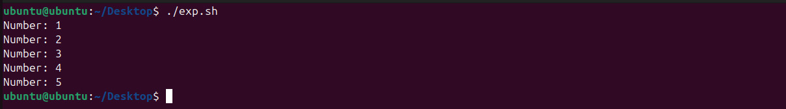
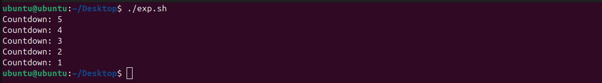

cat << 'EOF' > lab2.md
# 🔧 understanding how existing scripts in repo work

---

## 🔧 script 1
```bash
#!/bin/bash

for i in 1 2 3 4 5
do
  echo "Number: $i"
done
```

Example terminal output:



---

## 🔧 script 2
```bash
#!/bin/bash

count=5
while [ $count -gt 0 ]
do
  echo "Countdown: $count"
  count=$((count-1))
done
```

nano example:

---

### 🔧 Q1 what is the purpose of #!/bin/bash at the top of the script

*ans = the shebang line at the top of a script specifies the interpreter 
that should be used to the run the script.*

---

### 🔧 Q2 how do you make a script executable?

*ans = 1. add the shebang at the top  
       2. give permission using the chmod command  
       3. run the code.*
EOF
